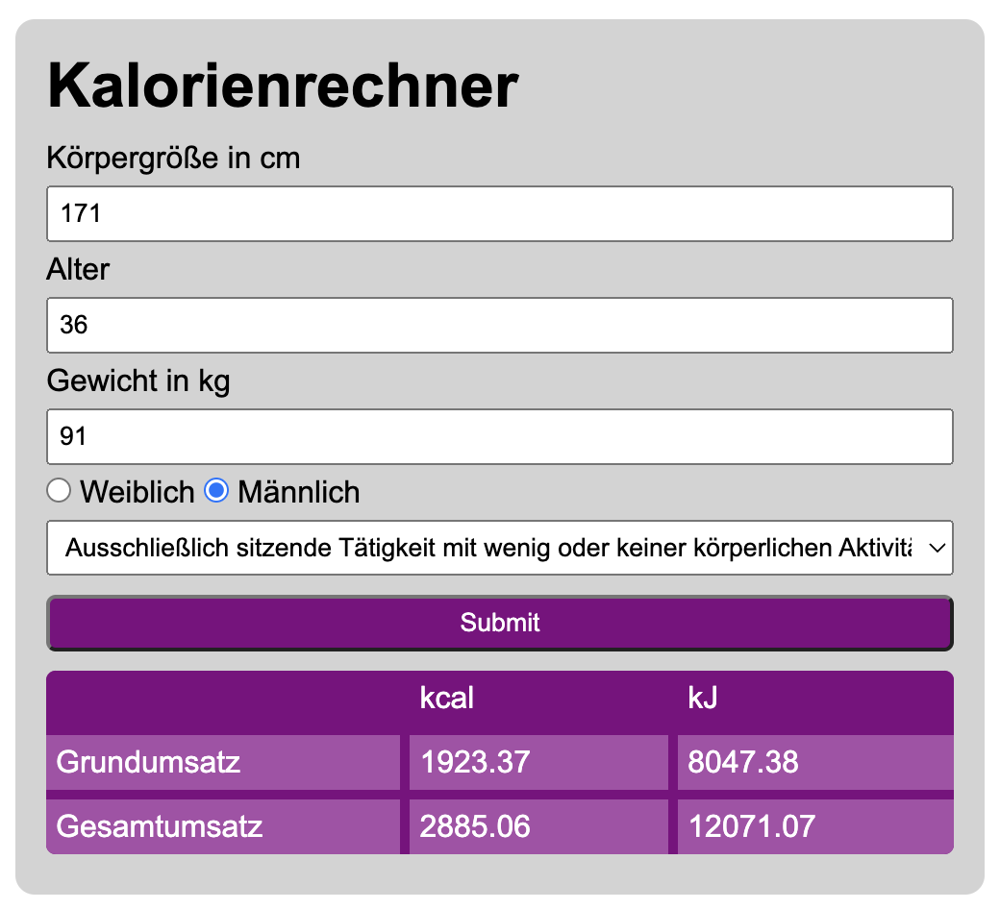

# Kalorienrechner

Dieser Rechner erlaubt das ermitteln des Grundumsatzes und Gesamtumsatzes in kcal und kJ.
Dabei werden die drei Eingaben Größe, Gewicht und Alter verrechnet, unter Berücksichtigung von Geschlecht und körperliche Aktivität.

Angewandte Lerninhalte:
- SASS
- Grid
- Arrow-Function
- addEventListener
## Screenshots

